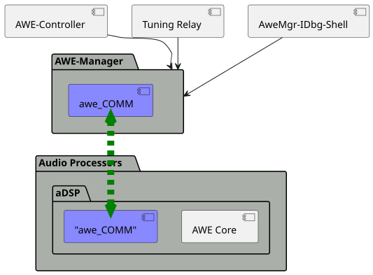

# AWE COMM: Context View

The awe_COMM component is a component inside {{name.awe_mgr}} and it is used to handle the communication of AWE commands (also called {{name.awe_tune_cmd}}) between {{name.awe_mgr}} and {{name.awe_host}}. It also contains code to handle the reading of event data originating from {{name.awe_host}}.

The following picture shows where awe_COMM is integrated.

Shown in the picture above, {{name.awe_mgr}} might have to handle several "clients", i.e., requests originating from various origins for tuning commands.

- {{name.controller}} - serializing and enqueuing requests from any system wide application. Those application may live on the same system or in other virtualized partitions
- Tuning Relay - a socket server component which allows a connection from AWE Designer running on a connected PC
- [AWE-Manager Shell][awe-manager-shell] - interactive debug shell or console

!!! note
    The "awe_COMM" component on the {{name.awe_host}} side is only shown to illustrate that handling of communication and protocol needs to work in conjunction with the component in {{name.awe_mgr}}. There is currently no awe_COMM code on the BSP side, even though it would be desirable to use the same awe_COMM code on both sides.