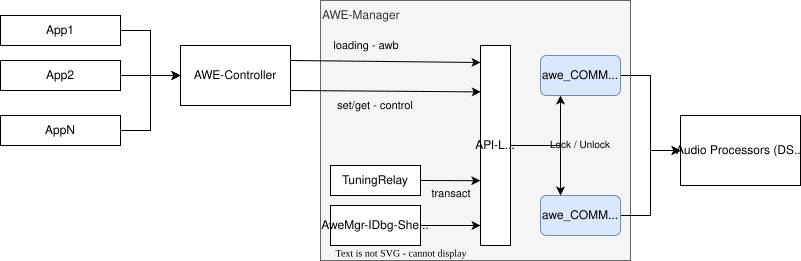
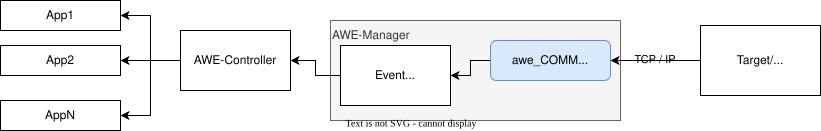
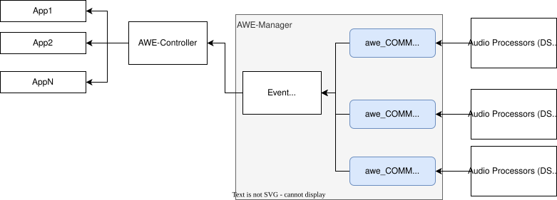
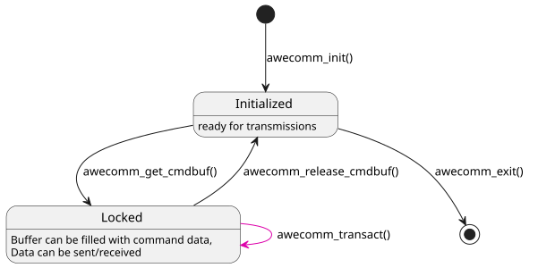

# AWE COMM: Internal Architecture

The awe_COMM component does not have any further sub-components.

## Buffer Concept

This section describes how buffers required for the communication are allocated and handled.

### Tuning Commands

Buffer handling for tuning commands is the same for all backends.

A socket backend can only consume a serialized sequence of commands. In other words, it holds only one command buffer per transaction. The same applies to the shared-memory connection currently, as {{name.awe_host}} (DSP, BSP code) only allocated space for one single tuning buffer in the memory in AWE-Q.

With the current "tunneling" concept to address Subcanvas objects, it is more suitable for awe_COMM to allocate more than one intermediate buffer which can be filled by calls to [awe_CMD][awe-cmd-overview], prior to transmission. Therefore, two communication channel buffers are used. Depending on the target address of a tuning command, one of the buffers is chosen for transmission.

Reasoning for a dedicated "tunnel-buffer": The "tunneling" concept foresees to pack the actual command, for example whether to read or write a variable, into another tuning command (PFID_BundlePacket). This would have meant to change every API in component awe_CMD, and hence it was deemed easier to maintain a specific transmission buffer which contains this "bundle header".

The buffers are allocated at initialization of awe_COMM with the buffer size configured via a [config setting][configuration-settings]. There are freed again during termination of the component.

Support for a mutex protection can be enabled (compile time setting), so that an undisturbed transaction (request/response) with the backend is ensured - see [event sequence](3_behavioral_view.md#tuning-commands).

### Event Data

Buffer handling for event data is different for socket and for (AWE-Q) shared-memory communication.

**Socket**:

The socket backend is currently only used with DSP Concepts internal audio processing, like AWECoreOS. Here, the event data is available in a serialized form and is simply read by awe_COMM from the socket. The event data is then dispatched to listeners or applications.

Note that this socket connection (currently) uses a different socket port than the one for tuning commands (see above). The socket properties can be set via [configuration parameters][configuration-settings].

**Shared Memory**:

In AWE-Q, the events may originate from various un-synchronized sources, e.g., from different DSP cores, which have unfortunately no IPC mechanism implemented to serialize the event data. Hence, each DSP/CPU core uses a dedicated buffer in shared memory. The awe_COMM event handling waits for any interrupt happening from any DSP/ARM, then polls the event buffers and dispatches the event data via {{name.awe_mgr}} to a client/application - see [event sequence](3_behavioral_view.md#event-data).

## Internal States

There is an initialization phase (`awecomm_init()` call) in which the channels are configured or allocated.

The buffer size is a [config setting][configuration-settings].

Once the initialization is done, clients of awe_COMM can obtain a handle to a communication buffer via `awecomm_get_cmdbuf()`. The buffer is filled with the tuning command.

Then the communication can be performed via the `awecomm_transact` function - see [event sequence](3_behavioral_view.md#tuning-commands).

After transaction, the buffer's mutex needs to be released again for others, using `awecomm_release_cmdbuf()`.

When the system (gracefully) shuts down, the `awecomm_exit` method has to be called. This then shuts down the backends, e.g. sockets are closed and memory is released.

The same state behavior applies for the events.

## Concurrent Operation

The underlying {{name.awe_lib}} in {{name.awe_host}} requires a strictly synchronous request-response behavior. While one transaction of a command is ongoing, no other tuning command can be transmitted by {{name.awe_mgr}}.

This causes a problem with {{name.awe_mgr}} commands which consume considerable time, like loading a complete AWB design. No other control operation would be possible during this time.

Therefore the [buffers used][buffer-concept] in awe_COMM component can be used from several threads. A (mutex) protection ensures a transaction of a command is terminated before and the buffer is released, before the next command is transmitted.

This way loading and control of a signal flow can happen concurrently, or the API can be used by several concurrently running threads. The configuration of the thread priorities lies outside the scope of the awe_COMM component and of {{name.awe_mgr}}.
