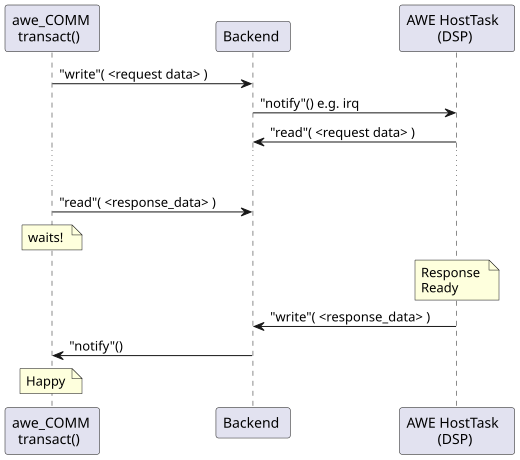
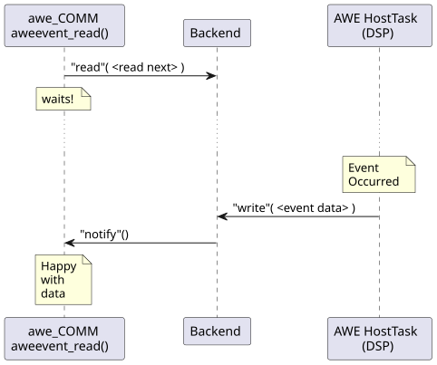

# AWE COMM: Behavioral View

This section introduces the concepts of the communication of awe_COMM with {{name.awe_host}}.

## Tuning Commands

The `awecomm_transact()` as the underlying method to communicate tuning commands is a **SYNCHRONOUS** call. This means that it waits for the other side to respond after it has sent a data package.

The [Concurrent Operation][concurrent-operation] section describes how different clients can operate in parallel.

The following picture shows a abstracted view of how data is being communicated. This concept is followed for all communication backends.

Data is being written to the backend and the other party is notified about this data.

In the case of a socket this is done by the socket iself - data will just be readable on the other side. The remote party's reading will pick up the data and provide the response. Correspondingly, the sender will wait in it's reading function.

In case of (shared) memory, the other side is notified by an interrupt (IPCC). Similarly, the "other side", e.g. the DSP will signal awe_COMM component that a response is available. Also in this case the `awecomm_transact()` method will wait until the response has arrived.

## Event Data

The `aweevent_read()` method reads event data from the backend. It is designed as a blocking function which waits until an event has been indicated.

