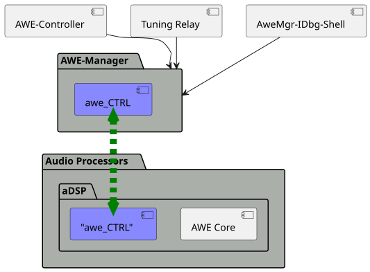

# AWE CTRL: Context View

The awe_CTRL component is a component inside {{name.awe_mgr}} and it is used to handle the communication of AWE commands (also called {{name.awe_tune_cmd}}) between {{name.awe_mgr}} and {{name.awe_host}}. It also contains code to handle the reading of event data originating from {{name.awe_host}}.

The following picture shows where awe_CTRL is integrated.

As shown in the picture above {{name.awe_mgr}} might have to handle several "clients", i.e., requests originating from various origins for tuning commands. 3 origins are foreseen:

- {{name.controller}} - serializing and enqueing requests from any system wide application. Those application may live on the same system or in other virtualized partitions 
- Tuning Relay - i.e. an AWE Designer running on a connected PC sends commands to the target system
- _OPTIONALLY_: AweMgr-IDbg-Shell - interactive debug shell or console

!!! note
    Currently, this concept of handling 3 "origins" is not fully implemented. {{name.awe_mgr}} is only and solely used by {{name.controller}}