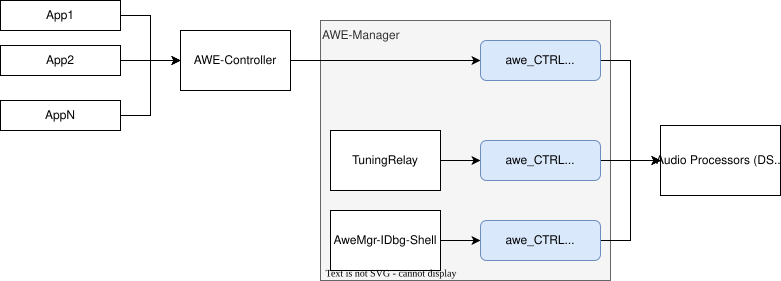
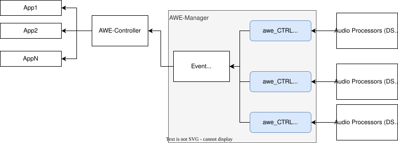
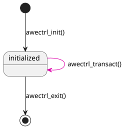

# AWE CTRL: Internal Architecture

awe_CTRL does not have any further sub-components. 

Depending on the backend, it handles the buffer allocation for [awe_CMD](../../awe_CMD/0_overview) though (socket).

## Buffer Concept 

### Tuning Commands

The communication between awe_CTRL and {{name.awe_host}} uses the concept of "channels". This means awe_CTRL can support more than one communication link between {{name.awe_mgr}} and {{name.awe_host}} and it assigns a channel for each link (see "clients" in the [context section](1_context_view.md)). A channel corresponds to a memory buffer in which those clients can write without interfering with others. 

In case the backend does not support the allocation/handling of all buffers (shared memory does, socket does not), awe_CTRL allocates the buffers and handles the synchronized access to the backend. It uses a mutex protection when data of one client is written to the backend and the response has to be waited for - see [event sequence](3_behavioral_view.md#tuning-commands).

If the backend supports holding the channel buffers (like shared memory does), the synchronization of access happens on {{name.awe_host}} side. This would be "woken up" to read and work on the next command in the appropriate channel buffer location - see [event sequence](3_behavioral_view.md#tuning-commands). 

The synchronization of user space applications is done by {{name.controller}}. It calls {{name.awe_mgr}} API to handle the requests and responses in a synchronous way and also is assigned one channel.

!!! note
    This concept is foreseen but not yet fully available for all backends.

### Event Data

Similar to the channel concept for tuning commands, the events may also originate from various unsynchronized sources, e.g., from different DSP cores. Each gets a dedicated channel buffer which is being read in collision free manner from an _Event Dispatcher_ which is part of the awe_CTRL component of {{name.awe_mgr}} - see [event sequence](3_behavioral_view.md#event-data).

## Internal States

There is an initialization phase (`awectrl_init` call) in which the channels are configured or allocated, depending on the selected backend. Possible backend specific configuration helper methods can be included by using internal header files.

The partitioning of buffers takes either place either in a pre-defined way, or it can be configured via {{name.awetc}} (later!).

Once the initialization is done, the communication can be performed via the `awectrl_transact` function - see [event sequence](3_behavioral_view.md#tuning-commands).

When the system shuts down (gracefully), a cleanup phase starts (via `awectrl_exit` method). In this phase, e.g. a socket is closed or memory is released.

The same state behavior applies for the events.