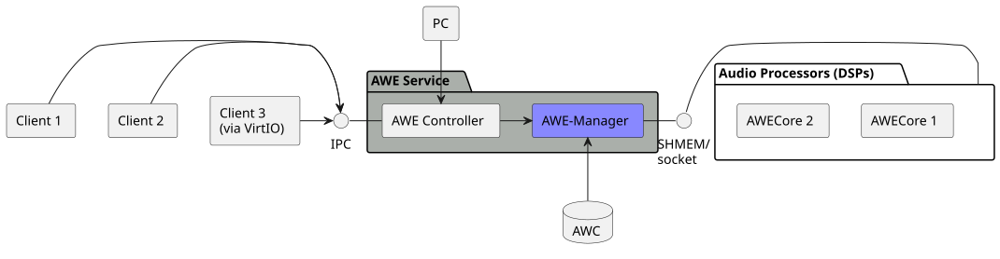

# Context View

This section explains how {{name.awe_mgr}} can be deployed.

## Library

{{name.awe_mgr}} is a library which is integrated into a platform audio service - here also called {{name.controller}}. This controller is implemented by the platform provider as it connects to very platform specific interfaces to handle the communication to and from applications. Applications may not even live on the same computing domain, i.e., applications may communicate with this {{name.controller}} over virtual machine boundaries. This communication is outside the scope of {{name.awe_mgr}}.





Once {{name.awe_mgr}} has received a request from {{name.controller}} it translates this request to an {{name.awe_tune_cmd}} and sends it to {{name.awe_host}}. The response message of {{name.awe_host}} is returned to {{name.controller}}.

The transport of {{name.awe_tune_cmd}}s between {{name.awe_mgr}} and {{name.awe_host}} can use either shared memory or socket.

{{name.awe_host}} is the component (or components) encapsulating the {{name.awe_lib}}.  An {{name.awe_sf}} is running and executed by {{name.awe_lib}}, i.e., it is consuming or 'pumping' audio data. {{name.awe_sf}} may contain controllable items which can be accessed in this state.


Applications do typically not know about the internal structure of the {{name.awe_sf}}. They rather refer to controllable items by name, e.g. 'MasterVolume' or 'LeftChannelMute'. The translation of those key-value pairs, e.g., `mastervolume=-12`, into {{name.awe_tune_cmd}} is handled by {{name.awe_mgr}} with the help of configuration data (named access).

{{name.controller}} can also pass through a valid {{name.awe_tune_cmd}} too ("raw" access). The calling application is fully responsible to construct this buffer correctly according to the [public documentation](https://w.dspconcepts.com/hubfs/Docs-AWECoreOS/AWECoreOS_UserGuide/a00075.html).

The configuration data is deployed to the platform together with other target files of the {{name.awe_sf}}. All target files, together with this configuration data, are considered to be an AWC storage ({{name.awe_awc_db}}). The AWC alone defines which of the controllable items of the {{name.awe_sf}} are published to applications with a control name; there is no re-compilation required when the AWC and/or {{name.awe_sf}} changes.

## AWE-Manager Shell

The shell is an executable program that includes {{name.awe_mgr}} library.

It provides a command-line like text interface for interactive interaction with the API.

Once started it provides argc/argv like command parsing to invoke specific functionality.

Examples of commands:

```
mgr_init
load_awc -awc awc_index.txt
load_design -name Main
info
```

!!! note
    Every command adheres to a `-h` or `-help` parameter. A full documentation of all shell commands will be provided later.

