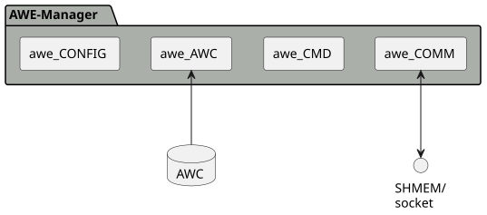

# Structural View

{{name.awe_mgr}} software is structured in a way that it internally is organized into sub-components, each with a dedicated purpose and well-defined interface.

- [awe_AWC][awe-awc-overview] component is used to read and parse the {{name.awe_awc_db}} index file into memory.
  It provides an API that is used to retrieve all relevant data of a controllable item in order to build an {{name.awe_tune_cmd}}.
    - {{name.awe_awc_db}} index file stores the mapping between control item names to AWECore specific handles. It is
    generated by additional tooling on the development PC and deployed to the target system.
- [awe_CMD][awe-cmd-overview] component constructs a valid {{name.awe_tune_cmd}} structure, given the information obtained from AWE before.
- [awe_COMM][awe-comm-overview] communicates the {{name.awe_tune_cmd}} to {{name.awe_host}} and receives the corresponding response.
- [awe_CONFIG][awe-config-overview] component stores the internal settings such as loglevels. Api's are provided to initialize, set and get the configurations.
