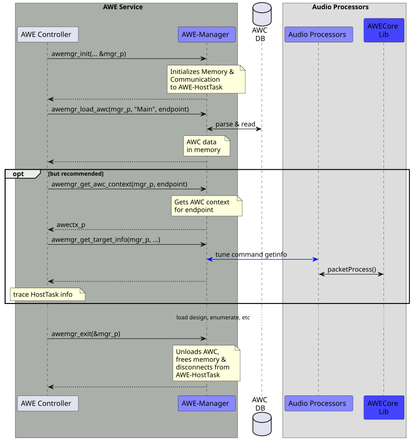
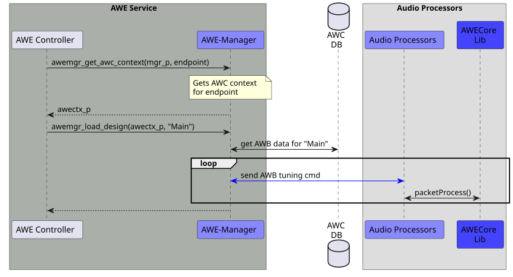
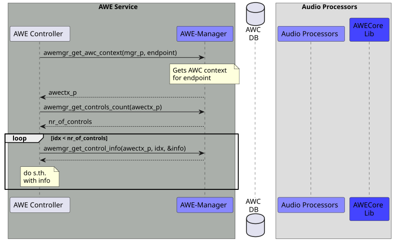
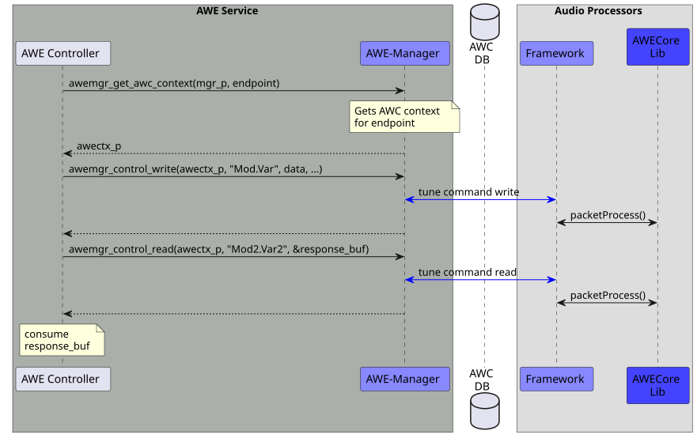
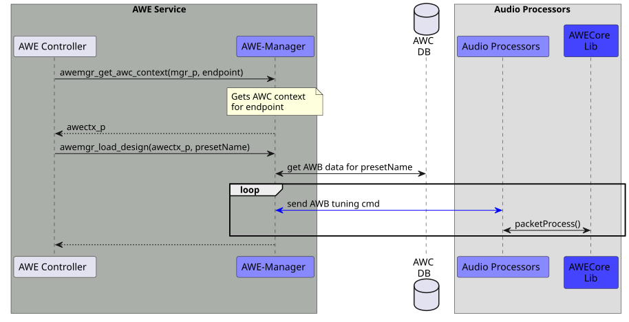
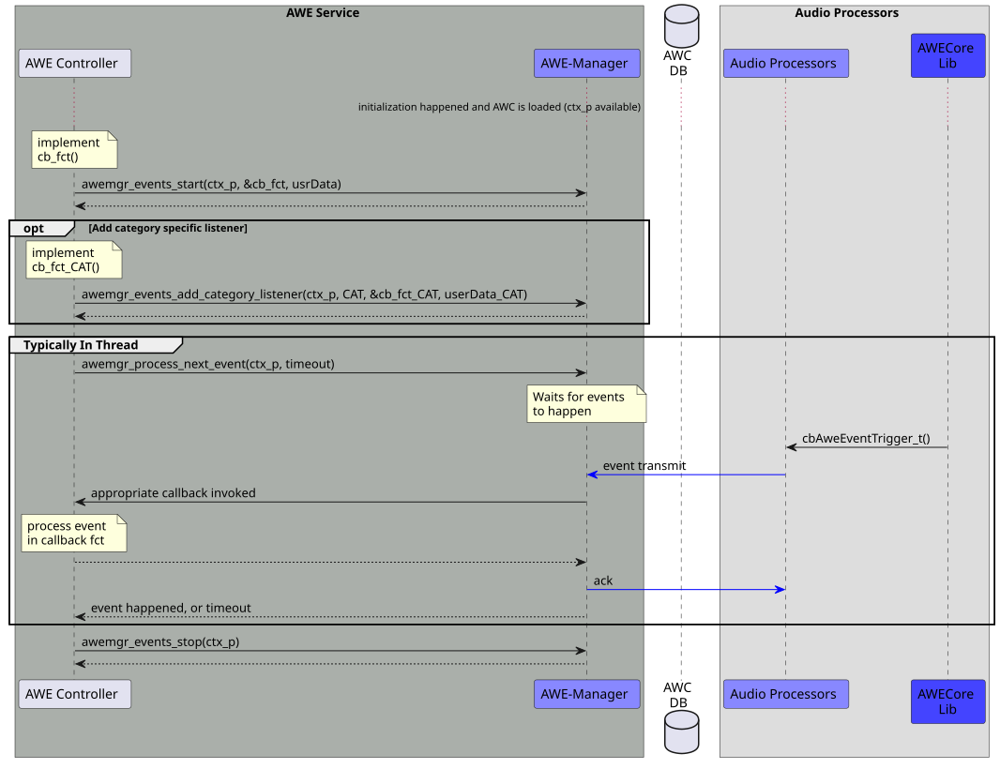

# Behavioral View

{{name.awe_mgr}} typically handles tasks/requests in a **synchronous** way, i.e., it does not maintain an internal state, nor does it use any kind of message IDs on its interface.

Any events occuring **asynchronously** from {{name.awe_lib}} or from {{name.awe_sf}} are dispatched to {{name.controller}} via callbacks. More details in the section below.

## Startup

During startup phase {{name.awe_mgr}} is initialized by {{name.controller}}. This allocates internal memory and, typically, also the index file of {{name.awe_awc_db}} is parsed and read into memory. Also, the communication component to {{name.awe_host}}, awe_CTRL, is powered up.

## Audio Start

When {{name.controller}} deems that it's ok to finally start audio processing, it can instruct {{name.awe_mgr}} to send the main AWB data to {{name.awe_host}}. The "main AWB" data is in fact the list of {{name.awe_tune_cmd}} messages that comprise the configuration and set up of the {{name.awe_sf}}.

Once this command is completed successfully, the {{name.awe_sf}} is running (*) in {{name.awe_host}} and applications can use the controlling API methods to modify the runtime behavior of the audio processing.

\*) _Please note that this in fact is only the case when the last instruction of the "main AWB" file is an `audio_start` command. This is typically the case though. See AWE Designer documentation for more details._

## Control Inventory

In order for an application to know about controllable items in {{name.awe_sf}} it can query {{name.awe_mgr}} for the list of such items.

This enumeration may also be used by clients of {{name.awe_mgr}} to obtain more information (size, value range, ...) about a controllable item or value.

## Controlling

Controlling typically involves reading or writing data from or to specific locations in the running {{name.awe_sf}}. Clients of {{name.awe_mgr}} specify those values (or the location where result data shall be written) directly as an interface parameter.

Size limits defined by system integration will apply, e.g. the maximum size of the payload data to be used on {{name.awe_mgr}}'s API is determined by the maximum size of the message buffer of the {{name.awe_tune_cmd}}. {{name.awe_mgr}} will return an error when those size limitations are violated.

{{name.awe_mgr}} is also able to check if control values used when writing adhere to range information provided in the {{name.awe_sf}}. If they don't match what was specified, an error will be returned.

## Preset Data

When several/many items of the {{name.awe_sf}} need to be changed at once this is typically done via preset-Data or preset AWBs. This data, in form of a special AWB file, has to be deployed to the target platform - together with the "main" AWB file and the AWC confiuration data.

!!! info
    This description of the process of generating the preset-Data (preset AWB files) is outside the scope of this document.

For clients of {{name.awe_mgr}} the API to apply a preset-AWB is exactly the same as for starting audio processing in the first place.

## Events

Events may either originate in {{name.awe_host}} from specific event modules inside the {{name.awe_sf}} or from the BSP software or {{name.awe_lib}} itself.

{{name.awe_mgr}} receives the event data and dispatches events to {{name.controller}} via callbacks. More information can be found in the [event data](awe_CTRL/2_structural_view.md#event-data) in awe_CTRL component.

The event callback structure returned in the callbacks not only contains event specific payload, it also indicates the type and the category of the event. The event type definition is up to the integrator of the system, as well as the event category (see [event structure section](awe_CTRL/4_resource_view.md#event-data) in awe_CTRL component for more details). {{name.awe_mgr}} does not know about those types, but uses a subscription pattern allowing {{name.controller}} to have dedicated callbacks per event category - instead of maintaining a big switch/case statement.

It is required to constantly observe incoming events. The reading of the next event is done by {{name.awe_mgr}} inside the `awemgr_process_next_event()` method (see [API](code.md#interface-files)). The [event sequence](awe_CTRL/3_behavioral_view.md#event-data) in awe_CTRL component shows the underlying communication pattern behind this call.

 Reading events typically is done in a separate reader thread. As an OS and platform agnostic library, {{name.awe_mgr}} does explicitly try to avoid creating any internal threading components as those would require platform specific configuration (priorities, names, ...) and there is no proper configuration concept (configuration API) available before this architecture can be investigated further. On the positive side, the subscription and "dispatch" pattern provided here leaves the full power over the threading in the hands of {{name.controller}}.

The following sequence shows how an application can use {{name.awe_mgr}} to implement callbacks for specific event categories.

