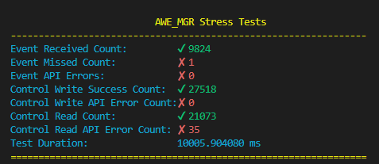

## Stress Test Execution

- Start `LinuxApp` in Background: `../awe_manager/tests/bin/linux_x86-64/LinuxApp -bsize:48 &` or start it in another terminal
- Start  `mgr_stress_test` with `./awe_manager/tests/stress_test/mgr_stress_test`
- The test runs for about 10 seconds by default, you can control the duration with command line argumenent  `-duration:` while launching the stress test. e.g. to run test for 1 min, `./awe_manager/tests/stress_test/mgr_stress_test -duration:60`

## Stress Test Results

- Event Received Count          - Number of Event Callbacks Triggered.
- Event Missed Count            - Differennce between the triggerCount of event Modules and the Event Received count.
- Event API Errors              - Number of times awemgr_process_next_event API returned error.
- Control Write Success Count   - Number of times awemgr_control_write API returned success.
- Control Write API Error Count - Number of times awemgr_control_write API returned error.
- Control Read Count            - Number of times awemgr_control_read API returned success.
- Control Read API Error Count  - Number of times awemgr_control_read API returned error.
- Test Duration                 - Actual test duration.
